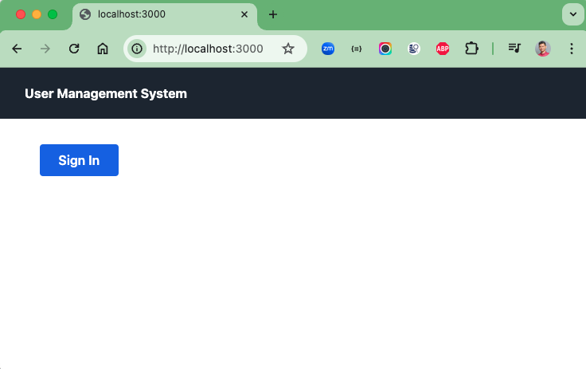
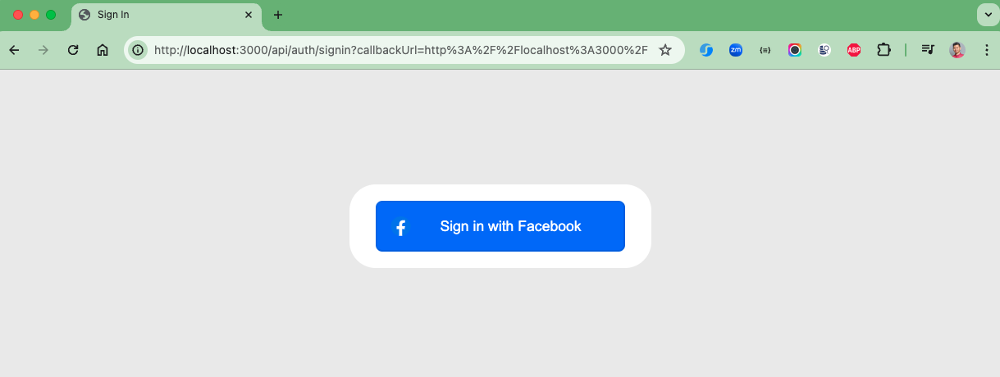
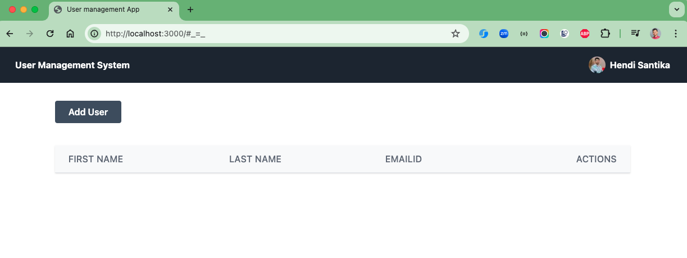
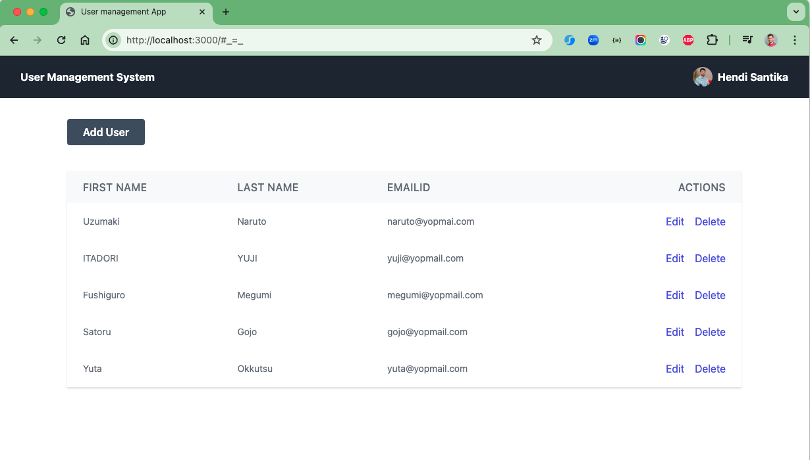
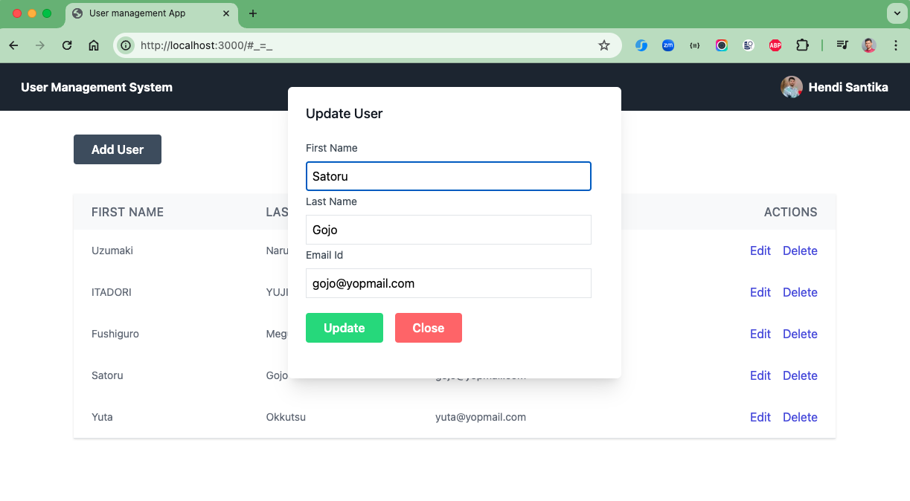

# user-management-nextjs
User Management Web App using Spring Boot and NextJS

### Things todo list

1. Clone this repository: `git clone https://github.com/hendisantika/user-management-nextjs.git`
2. Navigate to the folder: `cd user-management-nextjs`
3. Run Backend Service: `cd user-service`
4. Run the application: `mvn clean spring-boot:run`
5. Run Frontend: `cd frontend`
6. Run Frontend App: `pnpm install && pnpm run dev`
7. Open your favorite browser: http://localhost:3000

### Image Screenshots

Home Page

Sign In Page

List Users Page

Update User Page

